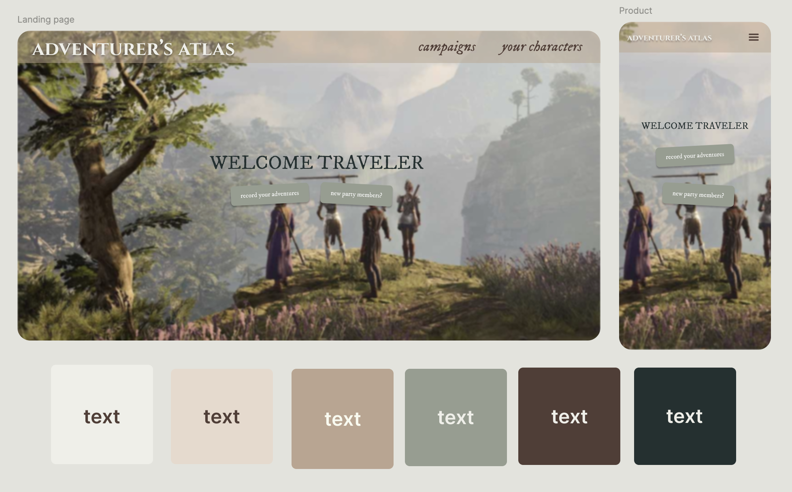
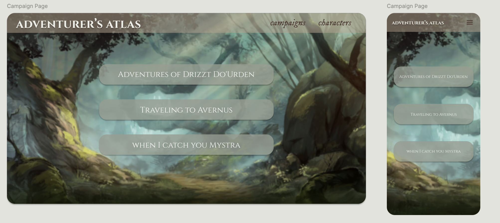
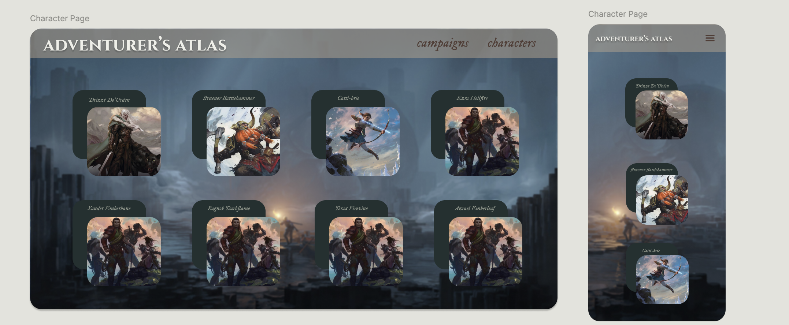
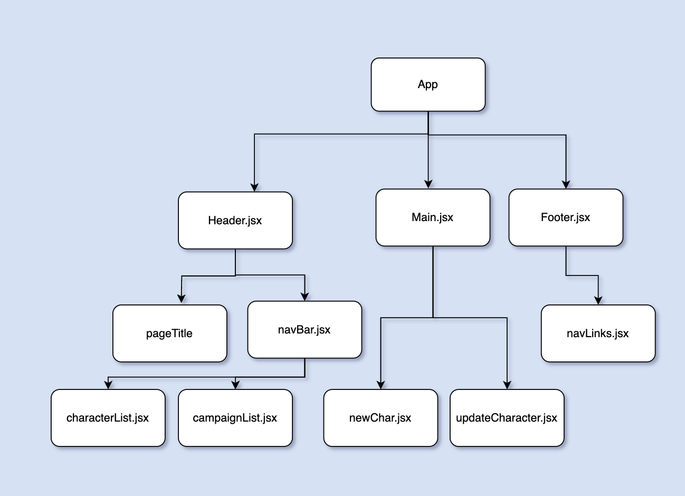
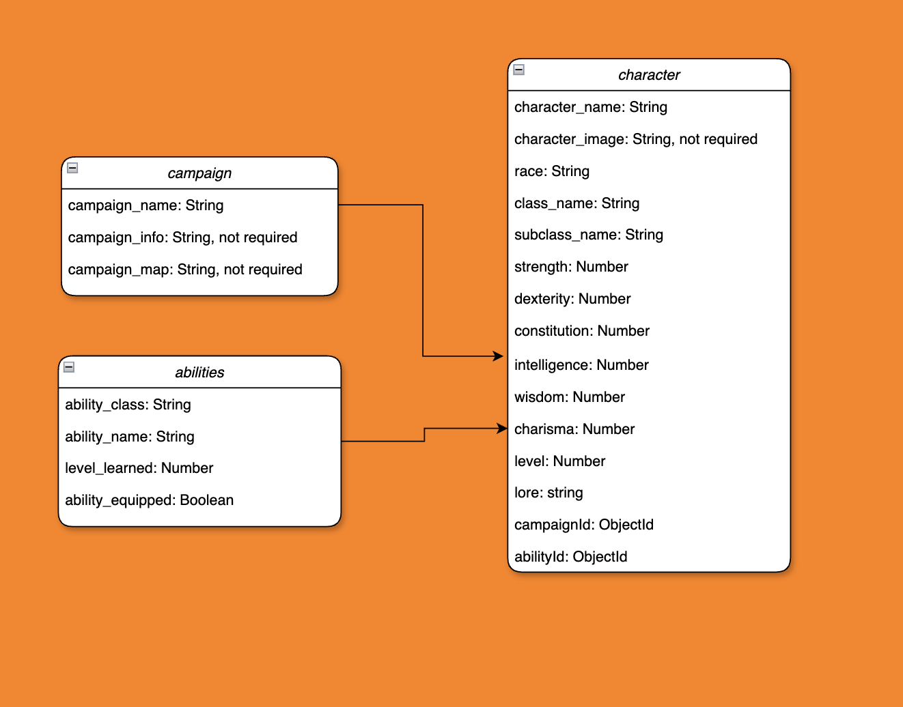
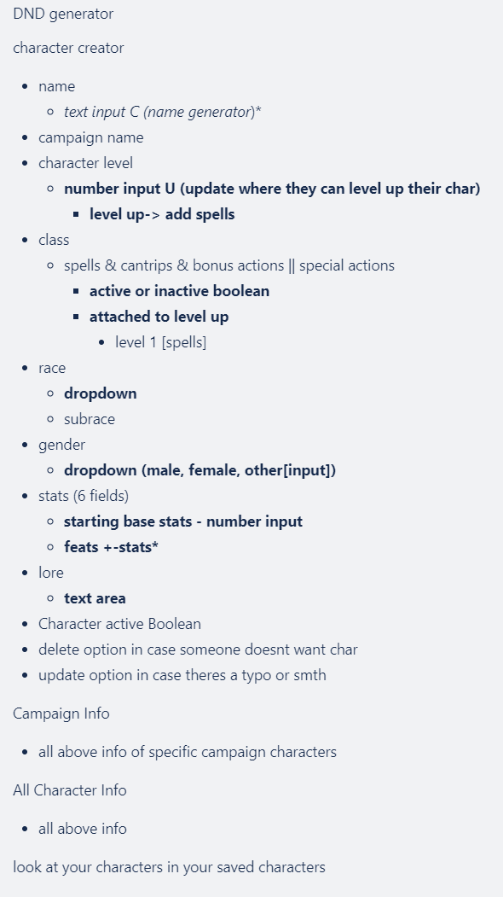
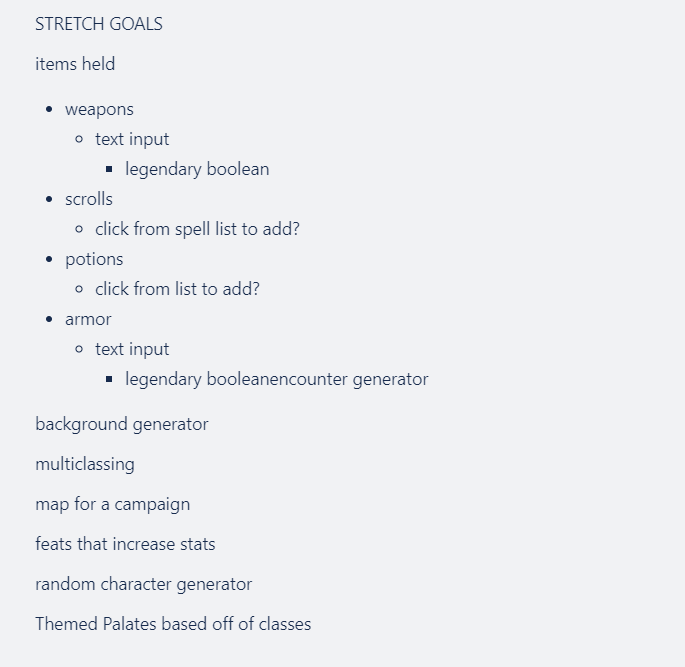

# ***DND Tracker - ADVENTURER'S ATLAS***

## Wireframming/ERDS

Adventurer's Atlas is a DND Character and Campaign creator. Users will be able to create and update their own DND characters. Users can edit their characters names, what campaigns they are on, their race, level, abilities and even update the characters own backstory and lore. 

Frontend:
Axios, CSS3 (Flexbox), HTML5, React.js, React Router, React-Bootsrap, and Vite

Middleware:
Body-Parser, Morgan

Backend:
CORS, Express.js, MongoDB (Mongoose), Node.js

Tools:
Git, GitHub, Trello

## STREEEEEEEEEEEEEETCHHHHHHH Goals

 

# Credit
Created by: 
[Kass Ferland Haroun](https://github.com/kfharoun)
[Tanner Gilliam](https://github.com/thebigbeanest)
[Gideon Cove](https://github.com/gideonMCove)

Assisted by:
[chatgpt](https://chatgpt.com)

[MDNWebDocs](https://developer.mozilla.org/en-US/)

[W3Schools](https://www.w3schools.com/)

[React.Dev](https://react.dev/)

All images are property of Wizards of the Coast and Larian Studios

This template provides a minimal setup to get React working in Vite with HMR and some ESLint rules.

Currently, two official plugins are available:

- [@vitejs/plugin-react](https://github.com/vitejs/vite-plugin-react/blob/main/packages/plugin-react/README.md) uses [Babel](https://babeljs.io/) for Fast Refresh
- [@vitejs/plugin-react-swc](https://github.com/vitejs/vite-plugin-react-swc) uses [SWC](https://swc.rs/) for Fast Refresh

