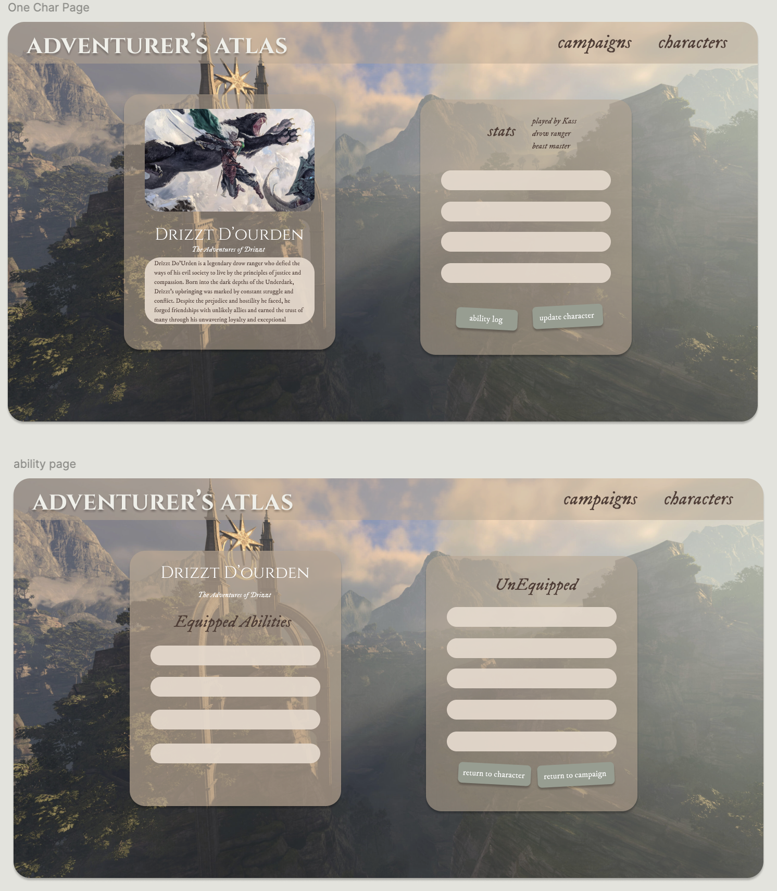

# ***DND Tracker - ADVENTURER'S ATLAS***

## Wireframming/ERDS

Adventurer's Atlas is a DND Character and Campaign creator. Users will be able to create and update their own DND characters. Users can edit their characters names, what campaigns they are on, their race, level, gender and even update the characters own backstory and lore. 

## MVP/User Story

User can create campaigns and characters. They can see a list of campaigns and characters they have made. Users can edit and delete existing campaigns and characters. Users can also search for spells and configure their characters as they level up.

## STREEEEEEEEEEEEEETCHHHHHHH Goals

 

# Credit
Created by: 
[Kass Ferland Haroun](https://github.com/kfharoun)
[Tanner Gilliam](https://github.com/thebigbeanest)
[Gideon Cove](https://github.com/gideonMCove)

This template provides a minimal setup to get React working in Vite with HMR and some ESLint rules.

Currently, two official plugins are available:

- [@vitejs/plugin-react](https://github.com/vitejs/vite-plugin-react/blob/main/packages/plugin-react/README.md) uses [Babel](https://babeljs.io/) for Fast Refresh
- [@vitejs/plugin-react-swc](https://github.com/vitejs/vite-plugin-react-swc) uses [SWC](https://swc.rs/) for Fast Refresh

## saturday notes

for tanner: 
* change booleans in ability to false (done)
* change level_learned to be the level the ability is learned, not the level of the ability 
* change magician to sorcerer (done)

gideon: 
abilities page 
* set boolean of equipped to true if clicked on, change classname to equipped or not equipped ? 
* show abilities of all abilities learned by level of that character (usecontext + dropdown?)

## sources
* used chatgpt to learn to time out an error message